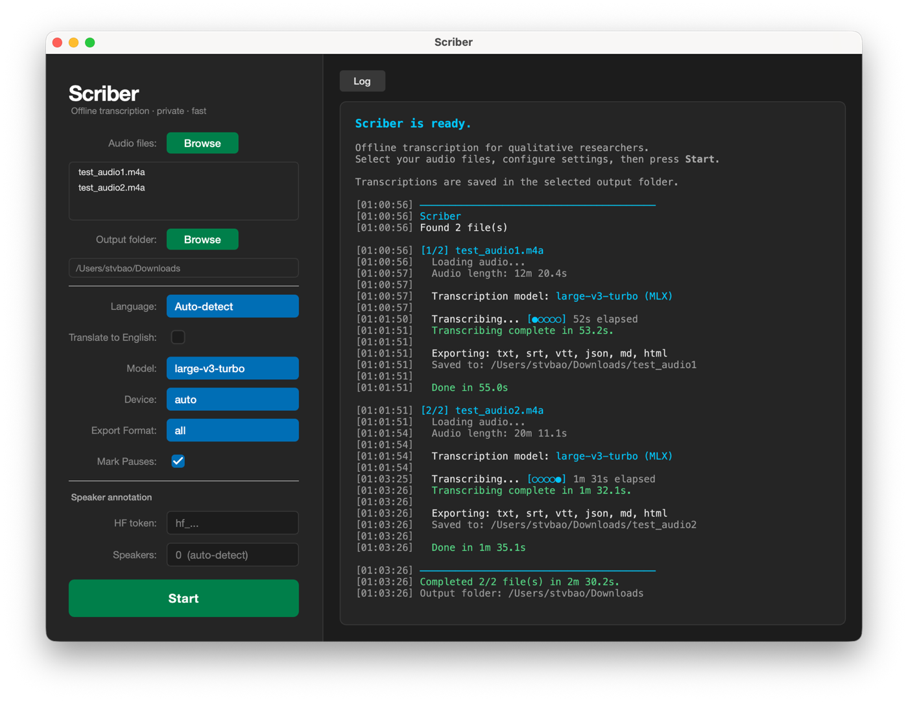

# Scriber

 

Transcription tool built for social scientists and qualitative researchers.

Drop in an audio file, get a transcript. Scriber runs entirely on your own machine — no cloud service, no subscription, and once the model downloads it works offline. Your recordings stay on your desk.



## Table of Contents

[Features](#features) · [Installation](#installation) · [How to Use](#how-to-use) · [Models and Platform Support](#models-and-platform-support) · [CLI Reference](#cli-reference) · [Data Privacy](#data-privacy) · [Roadmap](#roadmap) · [License](#license) · [Credits](#credits)

## Features

- **Desktop GUI and CLI** — use a point-and-click app or work in Terminal
- **Offline transcription** — audio stays on your machine
- **Batch processing** — transcribe one file or many in a single pass
- **Speaker annotation** — optional diarization with pyannote
- **Multiple export formats** — `txt`, `srt`, `vtt`, `json`, `md`, `html`
- **Pause markers** — optional pause labels in GUI exports
- **Apple Silicon optimized** — uses MLX automatically where available
- **Translation** — optionally translate speech to English
- **Local model cache** — models download once, then are reused

## Installation

### macOS

**Homebrew (recommended)** — Apple Silicon only:

```bash
brew tap stvbao/Scriber https://github.com/stvbao/Scriber
brew install scriber
```

Intel Mac users need to install from source — Homebrew support for Intel is on the [roadmap](#roadmap).


**From source** — any Mac (requires [uv](https://docs.astral.sh/uv/)):

```bash
git clone https://github.com/stvbao/Scriber.git
cd Scriber
uv sync
```

### Windows

A packaged Windows release is on the [roadmap](#roadmap). To install on Windows today, first install Python 3.12 and [uv](https://docs.astral.sh/uv/getting-started/installation/), then:

```powershell
git clone https://github.com/stvbao/Scriber.git
cd Scriber
uv sync
```

## How to Use

Run `scriber` or `scriber app` to open the GUI. 

If you installed from source, prefix with `uv run`.

For CLI usage, see [CLI Reference](#cli-reference) below.

### Speaker Annotation

Speaker annotation labels who is speaking — for example `SPEAKER_00`, `SPEAKER_01`, and so on. It requires a free Hugging Face account to download the diarization model.

To enable it:

1. Create a token at [hf.co/settings/tokens](https://hf.co/settings/tokens)
2. Accept the model license for [pyannote/speaker-diarization-community-1](https://huggingface.co/pyannote/speaker-diarization-community-1)
3. Paste the token into the GUI field, or pass `--hf-token` in the CLI
4. If you know the number of speakers, enter it in the GUI for better accuracy — leave it at 0 to auto-detect

The model downloads once and is cached locally. Annotation works best when speakers take clear turns; accuracy drops when people talk over each other, which is common in focus groups.

## Models and Platform Support

Scriber uses two transcription backends: [mlx-whisper](https://github.com/ml-explore/mlx-examples/tree/main/whisper) on Apple Silicon and [faster-whisper](https://github.com/SYSTRAN/faster-whisper) everywhere else. The `auto` setting picks the right one for your machine.

**Device:**

| Platform | Hardware | Backend | Speed |
|---|---|---|---|
| Mac (M1–M5) | Apple Silicon, macOS 14+ | MLX-Whisper (MLX) | Very fast |
| Mac (M1–M5) | Apple Silicon, macOS 13 | faster-whisper (CPU) | Good |
| Mac | Intel | faster-whisper (CPU) | Moderate |
| Windows/Linux | NVIDIA GPU | faster-whisper (CUDA) | Fast |
| Windows/Linux | CPU only | faster-whisper (CPU) | Slow but works |

**Models:**

| Model | Size | Speed | Accuracy |
|---|---|---|---|
| tiny | 39M | ~10x | Basic |
| base | 74M | ~7x | Decent |
| small | 244M | ~4x | Good |
| medium | 769M | ~2x | Very good |
| large-v2 | 1550M | 1x | Excellent |
| large-v3 | 1550M | 1x | Excellent |
| **large-v3-turbo** | **809M** | **~8x** | **Excellent (recommended)** |

Default model: `large-v3-turbo`. Models download on first use and are reused from the local cache. When translation is enabled, Scriber automatically switches to `large-v3` because the turbo variant does not support translation.

## CLI Reference

```
$ scriber --help

Offline transcription for qualitative researchers

commands:
  app          Launch the GUI
  transcribe   Transcribe audio files
  cache        Manage the local model cache
```

```
$ scriber transcribe --help

usage: scriber transcribe [options] files...

positional arguments:
  files                   Audio files to transcribe

options:
  --model    {large-v3-turbo,large-v3,large-v2,medium,small,base,tiny}
                          Whisper model to use (default: large-v3-turbo)
  --language LANGUAGE     Language code e.g. en, zh, fr (default: auto-detect)
  --export   {txt,srt,vtt,json,md,html,all}
                          Export format (default: all)
  --output   OUTPUT       Output directory (default: same as input)
  --device   {auto,cpu,gpu,mlx}
                          Device to use (default: auto)
  --annotate              Enable speaker annotation (requires --hf-token)
  --hf-token HF_TOKEN     HuggingFace token for speaker annotation
  --translate             Translate audio to English
```

**Examples:**

```bash
scriber transcribe interview.m4a
scriber transcribe interview.m4a --model large-v3 --export srt
scriber transcribe *.m4a --output ~/Desktop/transcripts
scriber transcribe interview.m4a --annotate --hf-token hf_xxxxx
```

```bash
# Model cache
scriber cache path
scriber cache clear
```

## Data Privacy

- Audio files are processed locally
- No transcription data is sent to a cloud service
- No API key is required for basic transcription
- Hugging Face is contacted only to download models
- Scriber does not send telemetry

## Roadmap

Scriber is under active development. Planned next:

- **Intel Mac Homebrew support** — publish an `x86_64` CLI bundle so Intel Mac users can install via Homebrew
- **Homebrew core support** — submit Scriber to homebrew-core so users can install with `brew install scriber` without adding a tap
- **Packaged releases** — a standalone macOS `.app` and a Windows `.exe`
- **Text translation via NLLB-200** — translate transcripts to English at the text level, compatible with all models including turbo

For the full engineering notes and task list, see [docs/PLAN.md](./docs/PLAN.md).

## License

Scriber is licensed under [GPL-3.0](./LICENSE).

By contributing code, documentation, or assets, you agree that your contribution may be distributed under `GPL-3.0-only` and may be relicensed as part of future versions of Scriber.

## Credits

- [faster-whisper](https://github.com/SYSTRAN/faster-whisper) — transcription backend for Intel Mac, Windows, and Linux
- [mlx-whisper](https://github.com/ml-explore/mlx-examples/tree/main/whisper) — transcription backend for Apple Silicon
- [pyannote.audio](https://github.com/pyannote/pyannote-audio) — speaker diarization
- [noScribe](https://github.com/kaixxx/noScribe) — GUI inspiration
- [whisply](https://github.com/tsmdt/whisply) — architecture inspiration
- Developed with assistance from Claude and OpenAI Codex
